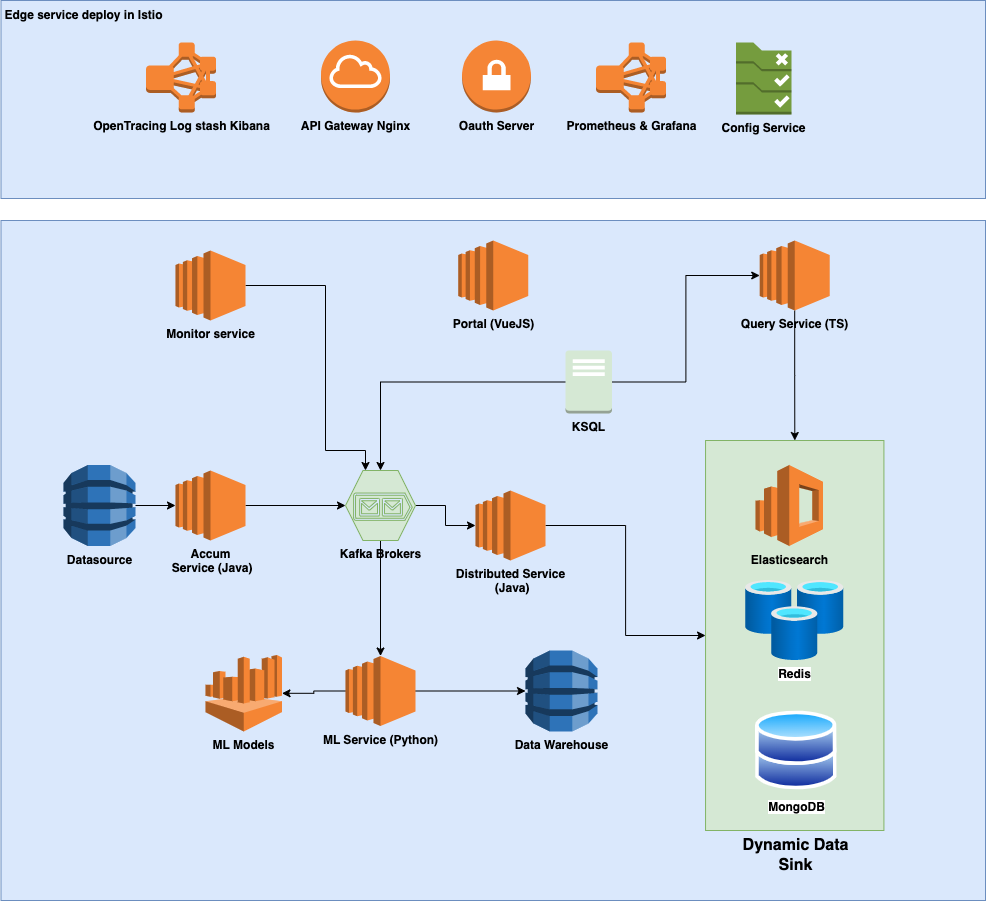

# Analytics platform projects

## 1. Architecture

 

## 2. Feature
- Accumulation:
  - Load data from files, database, message queue and transform into streaming kafka message
  - Aggregate data into KSQL and data warehouse
  - Design by CQRS pattern, datasource can be configured in portal, query service handle "READ" side of project.

 

## 3. Microservice repository

List of services used in this platform:

| Service | Repo | Description |
|-----------------|-----------------|-----------------|
| **Accum**  | [Link](https://github.com/kainguyen-dev/accum-service) | Load data from database, file, s3, stream kafka into message |
| **Portal**  | [Link](https://github.com/kainguyen-dev/portal-analytic) | Handle authentication, configuration |
| **Query**  | [Link](https://github.com/kainguyen-dev/query-service) | Read data from multiple source |
| **Dispense**  | [Link](https://github.com/kainguyen-dev/dispense-servicece) | Inject data to multiple datasource, can be configure at runtime |
| **ML**  | [Link](https://github.com/kainguyen-dev/ml-service) | Communicate with model |